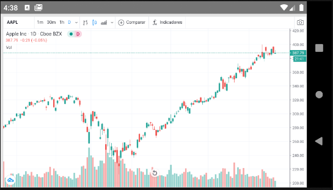
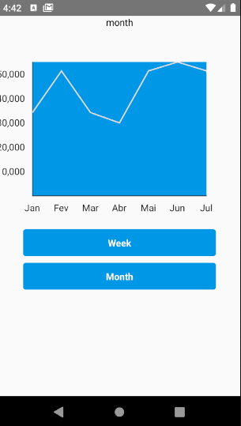

# Charts on React Native

## Options:
I've found two options to have good charts on mobile apps:

<strong>1 - React Native components:</strong>
The best I found was - victory-native

This lib has a good documentation explaning all the components and how to create custom components.

<strong>2 - Create a webview:</strong>

If you would like to have something very professional, equal to charts used by Investing app, create a webview and show a chart by Tradingview.

In this project I made both examples and you can try both just chaging the file that will be rendered:
1 - reactChart.js or
2 - index.js

The index.js is the webview. The source for it is a simple html page that I deloyed. It contains only the chart by Tradingview.

This html code is located under src/views/chart.html. You can deploy it using Netlify (takes 1 min the process) in order to use it in your webview component.

So, if you want to check the react native component, go to index.js (at the root of the project) and call for './src/reactChart/'.

If you want to check the webview component, go to index.js (at the root of the project) and call for './src'

<strong>Using Tradingview in a webview:</strong>

<strong>Using chart from victory-native:</strong>

